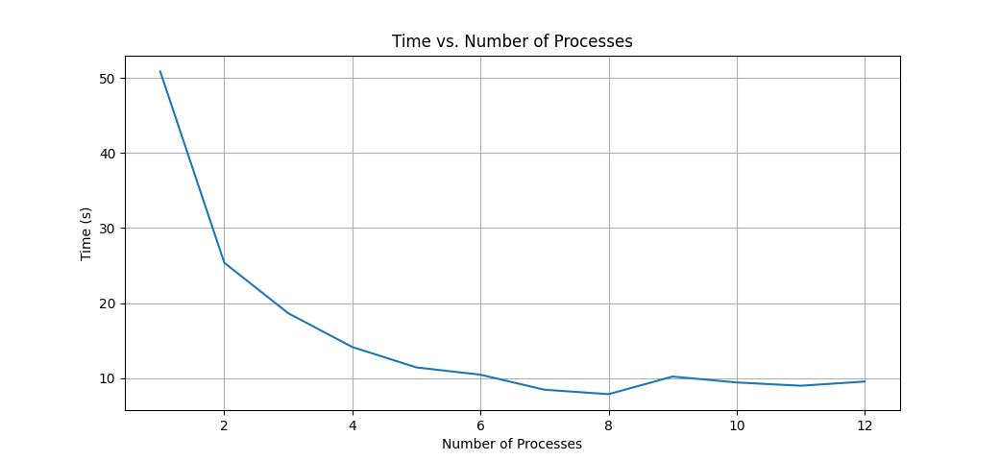
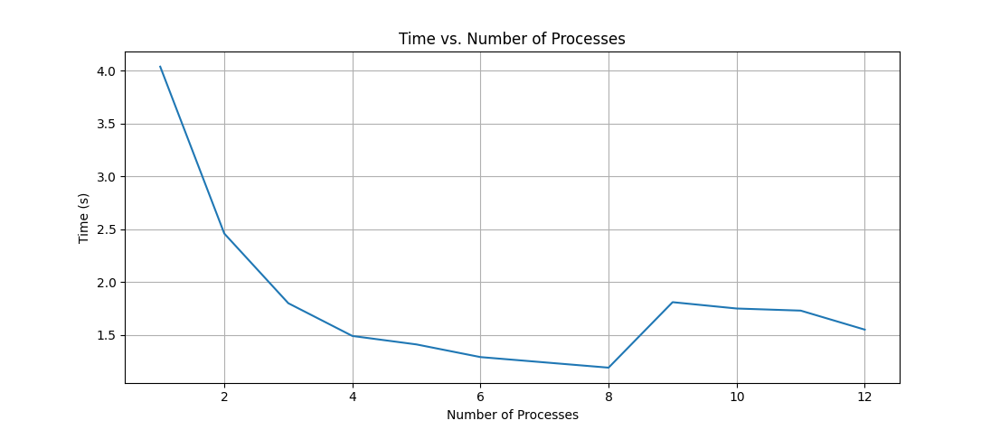
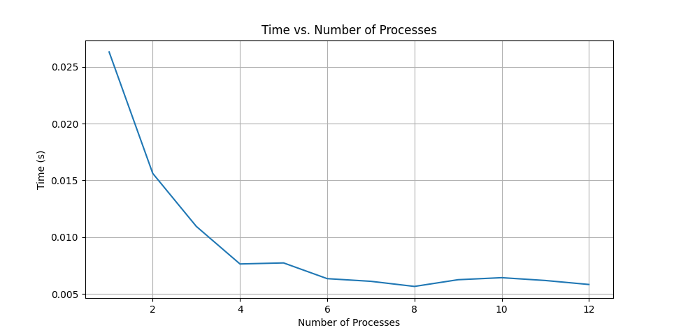

# 1 N Queens
On an N × N chessboard, you want to place N queens such that no queen attacks another. A queen attacks any other queen that is in the same row, column or diagonal. Given an integer N , write an MPI program that counts the number of ways to place N queens on the N × N chessboard.

## Input
The program takes a single constant N (the size of the chessboard) as input.

## Output
The program should print the number of ways to place the N queens on the chessboard.


## Constraints
$1 \leq N \leq 12$

## Example 
Sample Input
```
4
```
Sample Output
```
2
```

## Time Complexity 
$\mathcal{O}(n + n^2 + \frac{n!}{k} \cdot (n^2 + n)) = \mathcal{O}(\frac{n!}{k} \cdot n^2)$

## Message Complexity: 
$\mathcal{O}(log_2k)$

Only one MPI_Reduce call is used after each process individually computes their share. How many messages are produced by MPI_Reduce depends on the implementation of and openMPI chooses which algorithm to run based on the number of nodes in the communicator and the size of the data being broadcast. The total message complexity can be as efficient as $\mathcal{O}(log_2k)$ for openMPI implementation.

Total runtime would be: $\mathcal{O}(\frac{n!}{k} \cdot n^2) + T_{reduce}$

## Space Requirements 
$\mathcal{O}(n \cdot k)$

Each process is storing an array of size $n$ with factorial values up to $n$. Other than this, only a single vector storing the current board permutation and $\mathcal{O}(n)$ temporary space for computing $r^{th}$ ranked permutation. Overall, the space complexity is $\mathcal{O}(n)$.

## Performance Scaling
Below are the execution times of the program for $N=12$.
| n_procs | 1       | 2       | 3       | 4       | 5       | 6       | 7       | 8       | 9       | 10      | 11 | 12 | 
| ---     | ---     | ---     |---      | ---     | ---     | ---     | ---     | ---     | ---     | ---     | --- | --- | 
|time (s) | 50.85 | 25.38 | 18.65 | 14.15 | 11.44 | 10.47 | 8.47 | 7.88 | 10.22 | 9.44 | 9.00 | 9.56 |



# 2 Floyd-Warshall
The Floyd-Warshall algorithm is used to find the shortest paths between all pairs of nodes in a weighted graph. Write a parallel program to calculate the final adjacency matrix which represents shortest distance between all pairs. 

## Input 
The first line contains a single integer N , the number of vertices in the graph. Each of the next N lines contain N space separated integers. These represent the N ×N adjacency matrix of the graph. A[i][j] = weight of edge from node i to node j. (It will be −1 if there exists no edge from node i to node j) 

## Output 
The program should output the final N ×N adjacency matrix which represents shortest distance between all pairs. Output should contain N lines and each line should have N space separated integers such that A[i][j] is the shortest distance from node i to node j. 

## Constraints 
$1 <= N <= 1000$ 

$1 <= A[i][j] < 10^9$

Let $k$ be the number of processes and $n$ be the 
size of the adjacency matrix.

## Time Complexity 
$\mathcal{O}(\frac{n^3}{k})$

Each process is responsible for certain rows of the adjacency matrix and the rows are divided equally among the processes.

## Message Complexity: 
$\mathcal{O}(n \cdot log_2k + n^2)$

At the start of each $k$ iteration, the process responsible for the $k^{th}$ row broadcasts the row to all other processes. This is done $n$ times. The total message complexity is $\mathcal{O}(n \cdot (log_2k + n))$ assuming that one broadcast takes $\mathcal{O}(log_2k + n)$ messages. Again, this depends on the implementation of MPI_Bcast and openMPI chooses which algorithm to run based on the number of nodes in the communicator and the size of the data being broadcast. Additionally, there is a barrier call after each broadcast to ensure that all processes have received the broadcasted data before commencing the calculation of distances.

There is also one reduce call at the end to collect the final result from all processes. Complexity for this: $\mathcal{O}(log_2k + n)$

Total runtime would be: $\mathcal{O}(\frac{n^3}{k}) + n \cdot (T_{broadcast} + T_{synch})$


## Space Requirements 
$\mathcal{O}(n^3 \cdot k)$

Each process is storing the entire adjacency matrix.

## Performance Scaling
Below are the execution times of the program for an adjacency matrix of size 1000 x 1000 with edge weights chosen randomly.

| n_procs | 1       | 2       | 3       | 4       | 5       | 6       | 7       | 8       | 9       | 10      | 11 | 12 | 
| ---     | ---     | ---     |---      | ---     | ---     | ---     | ---     | ---     | ---     | ---     | --- | --- | 
|time (s) | 4.04 | 2.46 | 1.80 | 1.49 | 1.41 | 1.29 | 1.24 | 1.19 | 1.81 | 1.75 | 1.73 | 1.55 |



# 3 Conway's Game of Life
The Game of Life is a cellular automaton devised by mathematician John Con- way. It consists of a grid of cells, each of which can be in one of two states: alive or dead. The state of each cell evolves over time according to the following set of rules based on the neighboring cells.
1. Any live cell with fewer than two live neighbours dies, as if by underpopulation.
2. Any live cell with two or three live neighbours lives on to the next generation.
3. Any live cell with more than three live neighbours dies, as if by overpopulation.
4. Any dead cell with exactly three live neighbours becomes a live cell, as if by reproduction.

Refer this [link](https://playgameoflife.com/) for more information about the Game of Life or to simulate it on any initial configuration. You will be given an initial configuration of a grid of N × M cells. Write a program using MPI that simulates T generations in the Game of Life using this initial configuration.

## Input
The first line of input contains three space separated integers N, M, T representing the size of the grid and the number of generations to simulate. The next N lines would contain M space separated integers on each line, representing a grid of N rows and M columns. A value of 0 in this grid represents a “dead” cell and a value of 1 represents an “alive” cell.

## Output
Print an N × M grid of space separated integers that represents the state of the game after T generations. Dead cells would be represented by 0 and alive cells would be represented by 1. 

## Constraints
$N \leq 2$

$M \leq 2$

$N \cdot M \cdot T <= 1000000$

## Example
Sample Input
```
10 10 7
0 0 1 0 0 0 0 0 0 0
1 0 1 0 0 0 0 0 0 0
0 1 1 0 0 0 0 0 0 0
0 0 0 0 0 0 0 0 0 0
0 0 0 0 0 0 0 0 0 0
0 0 0 0 0 0 0 0 0 0
0 0 0 0 0 0 0 0 0 0
0 0 0 0 0 0 0 0 0 0
0 0 0 0 0 0 0 0 0 0
0 0 0 0 0 0 0 0 0 0
```
Sample Output
```
0 0 0 0 0 0 0 0 0 0
0 0 0 0 0 0 0 0 0 0
0 0 1 0 1 0 0 0 0 0
0 0 0 1 1 0 0 0 0 0
0 0 0 1 0 0 0 0 0 0
0 0 0 0 0 0 0 0 0 0
0 0 0 0 0 0 0 0 0 0
0 0 0 0 0 0 0 0 0 0
0 0 0 0 0 0 0 0 0 0
0 0 0 0 0 0 0 0 0 0
```
Let $k$ be the number of processes and $n, m, T$ be the inputs.

## Time Complexity 
$\mathcal{O}(\frac{(n \cdot m \cdot t)}{k})$

Each process is responsible for certain rows of the grid and the rows are divided equally among the processes.

## Message Complexity: 
$\mathcal{O}((T + n) \cdot m)$

In each iteration of time, each process sends atmost 2 messages and recives at most 2 messages containing an array of size m. Therefore there can be atmost $\mathcal{O}(m)$ messages from each process. At the end of calculations, each process sends the entire grid to the root process, where it is merged. This takes $\mathcal{O}(n \cdot m)$ messages.

Total runtime would be: $\mathcal{O}(\frac{n^3}{k}) + T \cdot (T_{send} + T_{synch})$

## Space Requirements 
$\mathcal{O}(n \cdot m \cdot k)$

Each process is storing the entire grid.

## Performance Scaling
Below are the execution times of the program for an adjacency matrix of size 1000 x 1000 with random initialization.

| n_procs | 1       | 2       | 3       | 4       | 5       | 6       | 7       | 8       | 9       | 10      | 11 | 12 | 
| ---     | ---     | ---     |---      | ---     | ---     | ---     | ---     | ---     | ---     | ---     | --- | --- | 
|time (s) | 0.0263241 |  0.0156181 | 0.0109414 | 0.00763358 | 0.00772546 | 0.00633998 | 0.00610485 | 0.00565365 | 0.00624497 | 0.00642487 | 0.00617687 | 0.00582522

